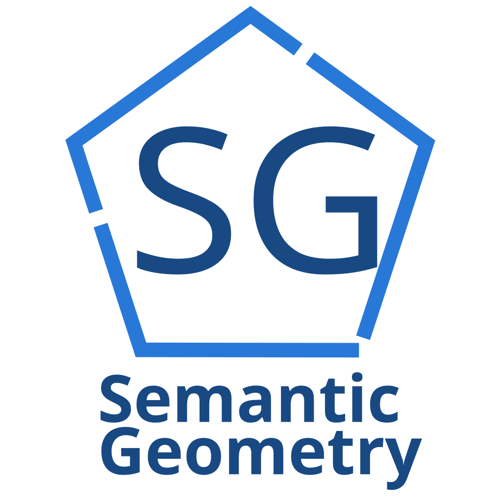

[![Contributors][contributors-shield]][contributors-url]
[![Forks][forks-shield]][forks-url]
[![Stargazers][stars-shield]][stars-url]
[![Issues][issues-shield]][issues-url]
[![Unlicense License][license-shield]][license-url]
<!-- [![Codecov][codecov-shield]][codecov-url]
[![Tests][tests-shield]][actions-url]
[![Release][release-shield]][actions-url] -->

<!-- PROJECT LOGO -->
 

  

  <h2 align="center">Semantic Geometry Bot</h2>

  

    Telegram bot interface for <a href="https://github.com/kretoffer/geometry.ostis">OSTIS system for adaptive geometry learning</a>
     
    <a href="https://github.com/kretoffer/tg-bot.geometry.ostis/tree/main/docs"><strong>Explore the docs »</strong></a>
     
     
    <a href="https://github.com/kretoffer/tg-bot.geometry.ostis/issues/new?labels=bug&template=BUG-REPORT.yml">Report Bug</a>
    &middot;
    <a href="https://github.com/kretoffer/tg-bot.geometry.ostis/issues/new?labels=enhancement&template=FEATURE-REQUEST.yml">Request Feature</a>
  

## About The Project
This project is an open-source Telegram bot interface designed to connect users with an adaptive educational platform powered by [SC-machine](https://github.com/ostis-ai/sc-machine). It provides a conversational front-end for personalized geometry learning, semantic querying, and interactive feedback — all within the familiar environment of Telegram.

### Key Features
- Adaptive learning flow based on user progress and semantic context

- Seamless integration with SC-machine via WebSocket for real-time knowledge queries

- Modular architecture using aiogram for scalable and maintainable async development

- Inline menus, onboarding, and progress tracking for engaging user experience

### Project Goals
<!-- - Provide a clean, testable codebase for educational bot development -->

- Enable rapid prototyping of adaptive learning interfaces using Telegram

- Serve as a reference for integrating SC-machine with modern async Python workflows

[contributors-shield]: https://img.shields.io/github/contributors/kretoffer/tg-bot.geometry.ostis
[contributors-url]: https://github.com/kretoffer/tg-bot.geometry.ostis/graphs/contributors
[forks-shield]: https://img.shields.io/github/forks/kretoffer/tg-bot.geometry.ostis.svg?style=flat
[forks-url]: https://github.com/kretoffer/tg-bot.geometry.ostis/network/members
[stars-shield]: https://img.shields.io/github/stars/kretoffer/tg-bot.geometry.ostis.svg?style=flat
[stars-url]: https://github.com/kretoffer/tg-bot.geometry.ostis/stargazers
[issues-shield]: https://img.shields.io/github/issues/kretoffer/tg-bot.geometry.ostis.svg?style=flat
[issues-url]: https://github.com/kretoffer/tg-bot.geometry.ostis/issues
[license-shield]: https://img.shields.io/github/license/kretoffer/tg-bot.geometry.ostis.svg?style=flat
[license-url]: https://github.com/kretoffer/tg-bot.geometry.ostis/blob/master/LICENSE